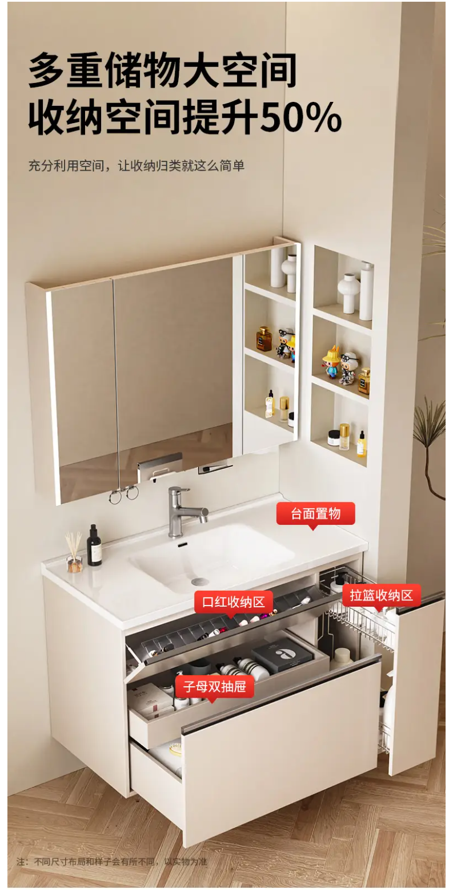
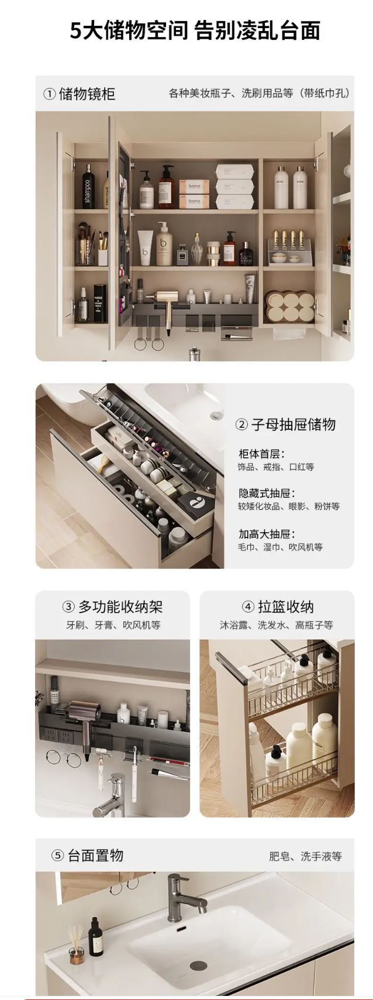

# 全屋定制柜体需求

## 需求概览

| 区域       | 子项         | 主要需求简述                                               | 详情 |
|------------|--------------|------------------------------------------------------------|------|
| 餐厨区域   | 厨房橱柜     | 多用抽屉/拉篮，预留调料盒拉篮、微波炉开放格及插座         | [厨房橱柜](#厨房橱柜) |
| 餐厨区域   | 厨房吊柜     | 放不常用物品，取放频率低，可接受稍麻烦设计                 | [厨房吊柜](#厨房吊柜) |
| 餐厨区域   | 厨房岛台     | 预留小家电、锅具、轨道插座、岩板电磁炉、水槽及净水口       | [厨房岛台](#厨房岛台) |
| 餐厨区域   | 餐边柜       | 洞洞板挂咖啡具，轨道插座方便咖啡机                        | [餐边柜](#餐边柜) |
| 书房       | 书桌         | 留线槽、洞洞板、显示器支架开孔                            | [书房](#书房) |
| 吧台       | 吧台         | 杯子、零食收纳及轨道插座                                  | [吧台](#吧台) |
| 主卧区域   | 主卧         | 脏衣篮收纳，方便拿放                                      | [主卧](#主卧) |
| 主卧区域   | 衣帽间       | 分区收纳，多挂衣，洞洞板挂包帽                            | [衣帽间](#衣帽间) |
| 主卧区域   | 主卧卫生间   | 吹风机、牙刷、卷纸、清洁用品收纳，尽量用拉篮，参考成品     | [主卧卫生间](#主卧卫生间) |
| 次卧       | 次卧         | 设计折叠床，节省空间                                      | [次卧](#次卧) |

## 具体需求

### 餐厨区域

#### 厨房橱柜

- 尽量都用抽屉或者拉篮，仅留一两个开门的柜子用来放大件物品
- 灶台下方右侧面需要预留一个调料盒拉篮
- 靠近蒸烤箱的位置需要预留底部开放格，用来放微波炉，需要预留电源插座

#### 厨房吊柜

- 尽量用好取放的设计，但非必须，吊柜用来放不常用的物品，取放频率较低，可以接受稍微麻烦一些的设计

#### 厨房岛台

- 需要预留位置，用来放小家电，例如电饭煲、电高压锅等，必须好拿放
- 需要有位置放非常用且不方便挂起来的锅具，比如铸铁锅
- 侧边预留轨道插座位置
- 岛台需要安装岩板电磁炉
- 岛台需要安装水槽，水槽需要有净水器出水口

#### 餐边柜

- 考虑餐边柜开放区域装洞洞板，用来挂一些常用的咖啡具，方便取放
- 需要有轨道插座位置，方便放咖啡机等

### 书房

- 书桌上需要留线槽通桌下，方便布线，线槽的长度尽可能长，能走更多的线，保证桌面整洁
- 书桌的墙面需要装洞洞板，用来挂常用的工具，方便取放
- 书桌居中稍微靠右的位置开孔用来安装显示器支架，开孔距离墙面20cm, 开孔直径最小5.5cm

### 吧台

- 需要预留存放杯子的空间，杯子需要好拿放
- 需要预留存放零食的空间，零食需要好拿放
- 需要预留轨道插座位置

### 主卧区域

#### 主卧

- 需要有位置放脏衣篮，脏衣篮需要好拿放

#### 衣帽间

- 需要有短衣区、长衣区、裤子区、内衣区，满足不同类型衣物的收纳需求
- 尽量多使用挂衣区，减少叠放区，方便取放
- 衣帽间进门左边的墙面做洞洞板，用来挂一些常用的包包、帽子等，方便取放

#### 主卧卫生间

- 浴室柜需要有位置放吹风机，吹风机需要好拿放，尽量可以直接留电源插座的位置
- 需要预留位置放牙刷等小物件，需要好拿放
- 需要预留位置放卷纸和抽纸
- 需要预留位置放卫生间清洁用品
- 尽量使用拉篮

**设计可以参考以下成品浴室柜**

- 链接：【京东】https://3.cn/2LQ8A-QL?jkl=@G5PdK9F7qg@ MU5104 「东鹏【智能日式收纳浴室柜】」
点击链接直接打开 或者复制文案打开京东

### 次卧

- 需要设计折叠床，平时可以收起来，节省空间
