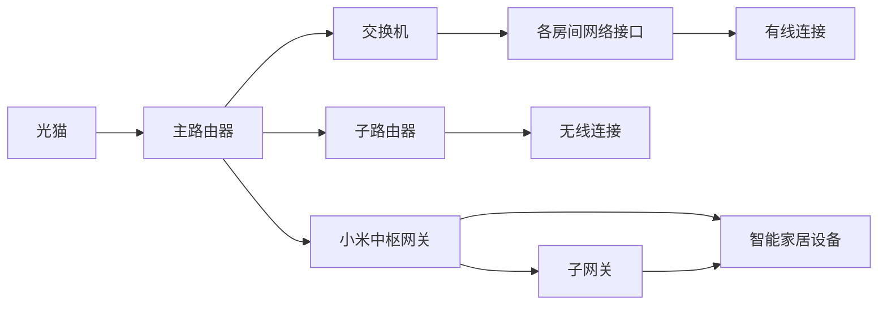
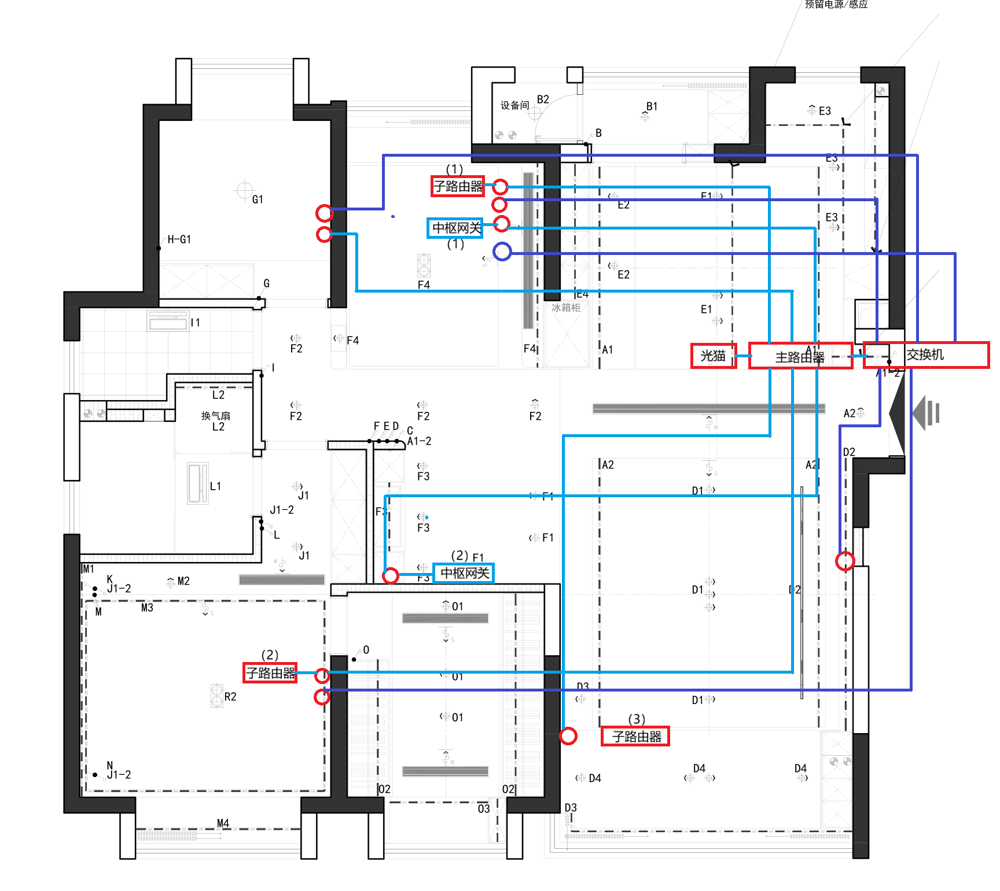

# 全屋网络说明

## 网路类型

有线子母路由mesh网络，主路由器连接光猫，子路由器分布在各个房间，提供无线覆盖。

## 网络拓扑结构

## 设备清单

- 光猫（ONT）：由ISP提供
- 主路由器：华为 Q7 主路由器
- 子路由器：华为 Q7 子路由器（3台）
- 交换机：TP-Link 16口千兆交换机
- 小米中枢网关：用于智能家居设备连接
- 各房间网络接口：预留千兆网口

## 布线说明

> **1. 红色圆圈表示网口**  
> **2. 浅蓝色连线代表与网口的连线或与主路由器的连线**  
> **3. 深蓝色连线代表与交换机的连线**

## 位置与供电说明

- 主路由器
    - 位置：玄关柜弱电箱
    - 供电：电源插座
- 子路由器1
    - 位置：书房桌子下方
    - 供电：POE供电
- 子路由器2
    - 位置：主卧墙面下方
    - 供电：POE供电
- 子路由器3
    - 位置：客厅沙发旁边
    - 供电：POE供电

- 交换机
    - 位置：玄关柜弱电箱
    - 供电：电源插座

- 小米中枢网关1
    - 位置：书房桌子上
    - 供电：电源插座
- 小米中枢网关2
    - 位置：吧台柜子里
    - 供电：电源插座
