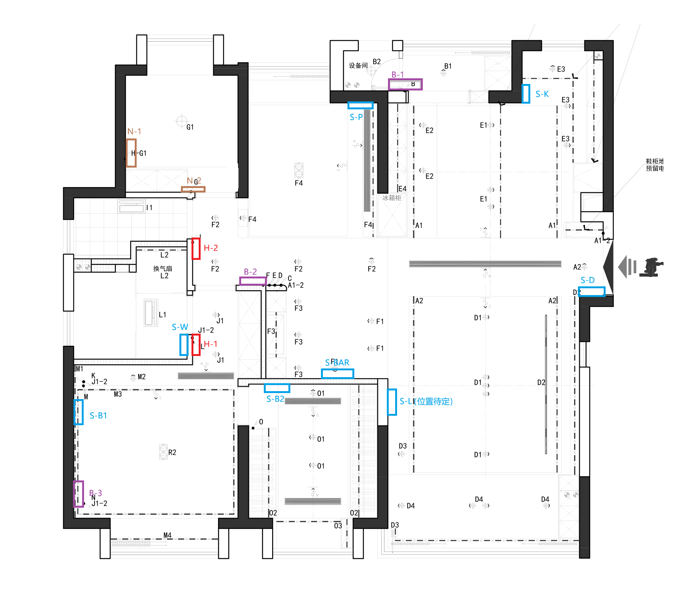

# 智能灯光说明

## 智能灯具清单

- 智能嵌入式射灯：10（客厅） + 10（餐厨）+ 10（过道）+ 6（卧室）
- 智能灯带：60米（所有除柜体、卫生间的灯带）
- 磁吸轨道灯：4个
- 双筒明装射灯：2个
- 主卫浴霸：1个

## 非智能灯具清单

- 客房吸顶灯: 1个
- 设备间吸顶灯: 1个
- 次卫浴霸: 1个

## 灯具尺寸

- 射灯：8.5cm

## 开关、控制面板

- S 开头的为智控面板，支持触摸屏控制，语音输入，以及三个灯控开关
- B 开头的为智能四开开关
- N 开头的为智能单开开关
- H 开头的为智能浴霸控制面板，接零火线，但不和浴霸直接连线，通过无线方式控制浴霸

## 智能开关说明

### 智控面板

智控面板是一个中控面板，集成了蓝牙mesh2.0从网关功能，支持触摸屏控制，语音输入，以及三个灯控开关。

- 三路继电器输出：独立（相当于 1 个进线火 L，3 个受控出线 L1/L2/L3；零线 N 在灯具侧共用）

- 总额定负载功率：400w
- 每路额定负载功率：130w

### 智能四开开关

智能四开开关支持单独控制四路灯光，每个开关也支持配置为无线模式，从而实现与智控面板的联动控制。

- 四路继电器输出：独立（相当于 1 个进线火 L，4 个受控出线 L1/L2/L3/L4；零线 N 在灯具侧共用）

- 总额定负载功率：1500w
- 每路额定负载功率：500w

### 智能单开开关

智能单开开关支持单独控制一路灯光。

## 智能开关接智能灯，会不会有问题？

结论：可以接，但要看“智能灯”是哪一类、以及开关是否会把电真正断掉。

- 情况 A：用智能开关的继电器去“断电/通电”智能灯（把智能灯当普通灯用）
	- 能工作：灯会亮/灭
	- 常见问题：
		- 断电后智能灯离线，App/语音/自动化不可用（直到再次上电）
		- 频繁断电会影响智能灯/LED 驱动寿命，且上电瞬间可能有浪涌电流
		- 断电后开关与灯的状态容易不同步（开关显示开，但灯因断电重启/掉线导致体验异常）

- 情况 B（推荐）：智能灯“常通电”，智能开关改为“无线模式/解耦模式”只发指令
	- 体验最好：智能灯始终在线，可调光/色温/联动/传感器自动化都稳定
	- 做法要点：
		- 灯具（或灯带电源/驱动）接到长期有电的回路；墙壁开关设置为无线/解耦，不再切断这一路
		- 墙壁按键用来触发场景（开/关/调光/色温/一键睡眠等），而不是切断电源

- 特别注意（免踩坑）：
	- 免零线智能开关对小功率 LED 负载更敏感，可能出现微亮/闪烁；智能灯/驱动更建议用零火版开关或直接常通电 + 无线控制
	- “智能灯带”通常是“灯带 + 电源/控制器”，实际需要常通电的是电源/控制器；如果被继电器断电，控制器会离线
	- 若担心需要“物理断电复位/检修”，可以保留一个上级回路断路器，或把某一路设置为维护用途（长按触发断电/上电，具体看型号支持）

## 智能灯光布线方案

### 餐厨区域

#### S-D

- L1：A2（客厅吊顶灯带 + 玄关射灯）
- L2：E1(岛台射灯) + E2(餐厅射灯) + E3(厨房射灯)
- L3：玄关底部灯带 + 橱柜底部灯带

#### S-L

- L1：D1(客厅中间的射灯)
- L2：D3(沙发上射灯、阳台窗帘灯带) + D4(阳台射灯)
- L3：D2(客厅磁吸轨道灯、电视柜灯带)

#### S-K

- L1：A1(餐厨灯带)
- L2：岛台灯带 + E4(餐边柜灯带)
- L3：-

### 生活阳台区域

#### B-1

- L1：- (无线模式，控制晾衣架灯光)
- L2：-（无线模式，控制晾衣架升）
- L3：-（无线模式，控制晾衣架降）
- L4: 设备间吸顶灯

### 吧台、过道区域

#### S-BAR

- L1：F3(吧台过道射灯 + 吧台灯带)
- L2：F1(吧台射灯)
- L3：F2(过道射灯)

### 书房区域

- L1：F4(书房双头射灯)
- L2：F4(书房书架灯带)
- L3：F4(端景射灯)

### 主卧主卫区域

#### S-W

- L1：L2(马桶间灯带)
- L2：L2(马桶间换气扇)
- L3：-

#### H-1

智能浴霸的控制面板，连接零火线，通过无线方式控制主卫浴霸。

#### B-2

- L1：J1(主卧过道射灯)
- L2：-
- L3：-

#### B-3

- L1：M1(主卧背景墙灯带) + M2(主卧边顶射灯)
- L2：M3(主卧顶部灯带)
- L3：M4(主卧窗帘灯带)
- L4：-

#### S-B1

只连零火线，通过无线方式控制主卧智能灯具。

#### S-B2

- L1: O1(衣帽间射灯)
- L2: O2(衣帽间灯带)
- L3: O3(衣帽间窗帘灯带)

### 次卧次卫区域

#### H-2

智能浴霸的控制面板，连接零火线，通过无线方式控制次卫浴霸。

#### N-1

- L1：次卧吸顶灯

#### N-2

- L1：- (无线模式，控制次卧吸顶灯)
