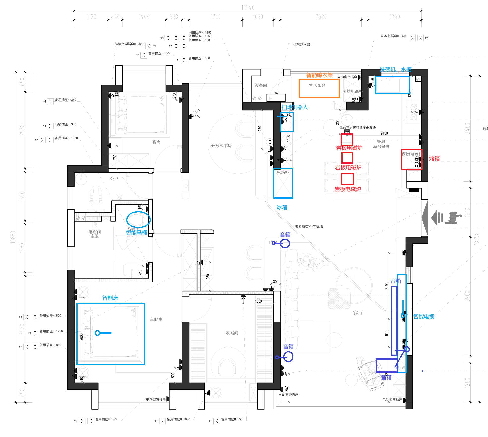
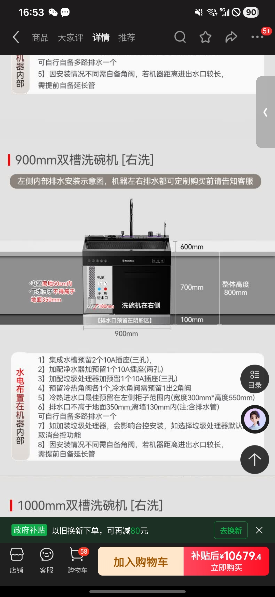

# 电器与插座说明

## 电器说明

### 设备清单

#### 电视

常规连接

#### 音箱（家庭影院）4个

电视柜下两个，沙发旁两个，均需要电源插座。

- 电源连接方式：插座

#### 烤箱

嵌入式烤箱，安装在厨房橱柜内。

#### 冰箱

嵌入式冰箱，安装在厨房橱柜内。

#### 智能晾衣架

- 电源连接方式：顶部连接电源线，不需要走灯路
- 控制方式：无线控制（通过智能开关或App控制）

#### 集成水槽、洗碗机

#### 扫地机器人

常规

#### 智能床

- 电源连接方式：地上直接连接电源线，不需要插座

## 插座额外说明

1. 需要留岛台的侧边插座，方便厨房小电器使用
2. 书房桌子下方需要预留插座，方便电脑等设备使用
3. 书桌上方需要预留插座，方便台上设备使用
4. 智能床下方需要预留电源线，方便智能床使用（注意埋管防水）
