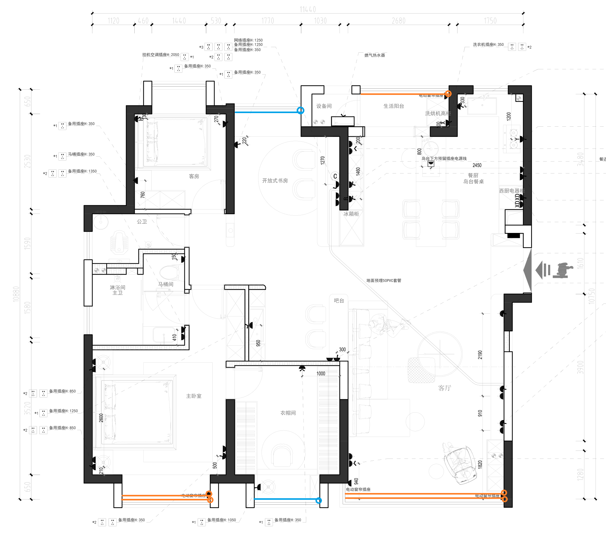

# 智能遮阳点位说明

智能遮阳点位是指在建筑物或设施中安装的用于控制遮阳设备（如遮阳帘、百叶窗等）的位置。这些点位通常配备有智能控制系统，可以根据环境光照、温度、时间等因素自动调节遮阳设备的开合状态，以提升室内舒适度和节能效果。

## 智能窗帘类型

### 智能双轨窗帘

- 窗帘盒宽度：>= 20
- 按装方式：顶部打孔安装
- 供电点位：侧边任意位置

### 智能单轨窗帘

- 窗帘盒宽度：>= 12
- 供电点位：侧边任意位置

### 智能百叶窗

- 窗帘盒宽度：>= 12
- 供电点位：侧边任意位置

## 点位图

- 黄色线代表窗帘轨道
- 蓝色线代表百叶窗
- 圆圈代表电源接电点位

